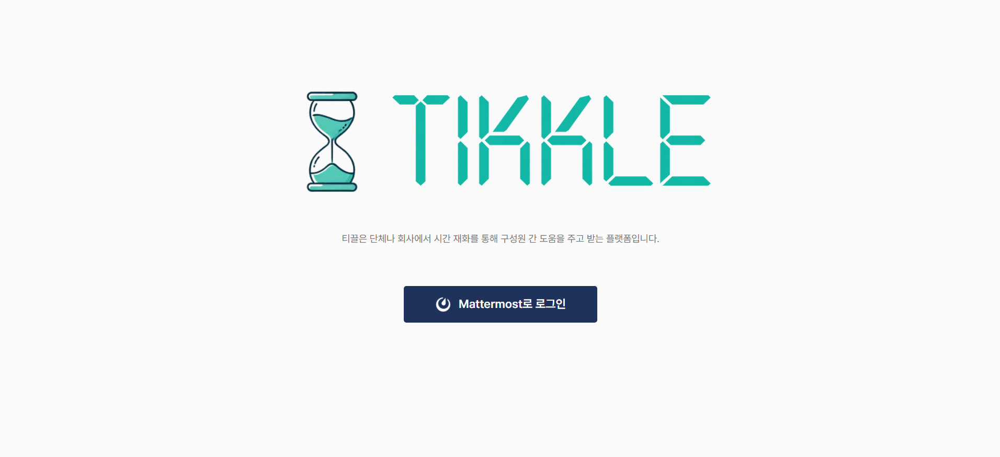

# README

# 티끌 (Tikkle) - 시간 재화를 통한 상호 협력 플랫폼

## 프로젝트 소개

**티끌(Tikkle)** 은 시간이라는 재화를 활용하여 단체나 회사 구성원들이 상호 간에 도움을 주고받을 수 있는 플랫폼입니다. 이 플랫폼을 통해 사용자는 자신의 시간을 투자하여 다른 사람에게 도움을 주고, 그에 대한 보상으로 시간을 얻어 다시 필요한 도움을 받을 수 있습니다.

- 배포 URL : [https://j11a501.p.ssafy.io](https://j11a501.p.ssafy.io/)
- Test ID : `test1_a501` / `test2_a501`
- Test PW : `HY2Pq2oZlZ2w6ZcSdBLVCkWu`

**주요 기능**

- 시간(재화)에 기반해 게시글로 특정 도움을 요청하고 거래
- 랭킹 시스템 및 랭킹에 기반한 리워드 설정 기능 제공
- 시간(재화)-랭킹 포인트 간 환율 기능

## 팀원 구성

| 김성윤 (FE, BE) | 손영준 (팀장, BE, Infra) | 유서현 (FE) | 이규빈 (BE) | 표다영 (FE, Design) | 허동민 (BE) |
| --- | --- | --- | --- | --- | --- |
| [@seongY0-0n](https://github.com/seongY0-0n) | [@glenn-syj](https://github.com/glenn-syj) | [@clare-u](https://github.com/clare-u) | [@Lee9Bin](https://github.com/Lee9Bin) | [@celestedayoung](https://github.com/celestedayoung) | [@hurdong](https://github.com/HurDong) |

## 개발 환경

- **Front-end** : Next.js, Tailwind, Typescript, Tanstack Query, Zustand
- **Back-end** : Spring Boot, MariaDB, Redis, Kafka, MongoDB
- **버전 및 이슈관리** : Gitlab, Jira
- **협업 툴** : Notion, Mattermost
- **서비스 배포 환경** : AWS EC2, Docker, Jenkins, NginX
- **디자인** : Figma
- **개발기간** : 24.08.26 ~24.10.11 (7주)

## 채택한 개발 기술과 브랜치 전략

### Front-end

- Next.js
    - 대부분의 페이지를 static page로 구성하여 CSR이 아닌 SSR을 활용해 사용자에게 빠르게 정보  전달
- Tailwind
    - CSS 파일을 별도로 작성하지 않고 즉각적으로 스타일링이 가능
    - `tailwind.config.ts` 파일을 통해 커스텀 스타일을 설정하여 팀원 간 일관된 UI/UX 구현
- Typescript
    - 안전하고 정확한 API 통신을 위한 Type 지정 및 커스텀 API handler로 효율적인 HTTP 통신
- Tanstack Query
    - 비동기 데이터를 효율적으로 캐싱, 동기화, 갱신할 수 있도록 사용
    - 리액트 훅을 통해 상태 관리가 자연스럽게 통합되며, 비동기 데이터와 관련된 복잡한 로직을 간결하게 작성 가능
- Zustand
    - 불필요한 props drilling을 피하고, 필요한 컴포넌트 내부에서만 상태 값을 가져다 사용하기 위해 상태 관리 라이브러리 사용
    - Redux에 비해 상태 관리에 필요한 보일러플레이트 코드가 적고, 단순한 설정만으로도 애플리케이션의 상태 관리를 쉽게 구현 가능

### Back-end

- Spring Boot
- MariaDB
- Redis
- Kafka
- MongoDB

### Infra

- AWS EC2
- Docker
- Jenkins
- NginX

### 브랜치 전략

- Github Flow: 7주 기간의 호흡으로 작업하며 일정상 마지막 주차에 배포가 이루어지기 때문에 채택

## 아키텍쳐

_1.png)

## ERD

## 역할 분담

### 김성윤

FE

- 공고 페이지: 공고 검색기능, 공고 카테고리 분류, 페이지네이션, 공고 작성 페이지, 공고 수정 및 삭제 기능
- 로그인 페이지: mattermost 로그인, 로그아웃 기능, zustand로 멤버 정보 상태관리
- 메인 페이지: 레이아웃 마크업

BE

- 공고 : 공고 CRUD RESTapi

### 손영준

BE

- Spring Security: JWT + mattermost OAuth2 회원 관리
- Redis를 활용한 Refresh Token Rotation 구현
- 채팅 / 환전 / 리뷰 / 약속 기능 디버깅 및 개선 참여
- 공통 예외 클래스, 에러 코드 및 핸들러 작성

Infra

- Jenkins CI/CD를 통한 통합 및 배포 자동화 (Jenkins Pipeline)
- Gitlab-Jenkins 연동
- Docker-compose 파일 및 spring boot application 파일 작성
- NginX 등 EC2 인스턴스 내 보안 처리

### 유서현

- 담당 페이지: 헤더(네비게이션), 채팅, 랭킹, 환전
- 채팅 기능, 약속 기능, 리뷰 기능, 랭킹 기능, 환전 기능 연동
- 게시글에 대해 마크다운 적용이 가능한 에디터와 뷰어 적용, 환율 차트 d3 라이브러리를 통해 적용

### 이규빈

- Redis 캐시를 활용한 랭킹 구현
- 자체 환율 및 스케줄러 구현
- 환전 기능 구현
- 데이터베이스 프로시저 구현

### 표다영

- 디자인 및 디자인 시스템 설계
- TypeScript & Axios 커스텀 Handler 작성
- 담당 페이지: 메인, 마이페이지

### 허동민

- Kafka와 STOMP를 활용한 실시간 1대1 채팅방 서버 구현
- MongoDB 를 활용하여 채팅 내역을 저장 관리
- 채팅방 도메인 기능 / 약속 도메인 기능 / 게시글 일부 기능 / 리뷰 일부 기능 구현

## 기능 설명 & 화면 구성

### 1. 랜딩 페이지

`/`

- `랜딩 페이지`에는 로고와 플랫폼에 대한 간단한 설명이 포함되어 있습니다.
- **로그인 기능**: 사용자는 `Mattermost OAuth`를 통해 로그인 할 수 있습니다.
- **서비스 소개**: 스크롤을 내리면 서비스에 대한 소개 이미지와 안내 문구가 있습니다.

### 2. 홈 페이지

`/home`

.gif)

- 로그인 이후 `대시보드` 형태의 `/home` 으로 리다이렉트 됩니다.
- **네비게이션**: 상단에 고정된 `네비게이션`을 통해 게시판, 랭킹, 환전, 채팅 페이지로 이동이 가능합니다.
    - 로그인 된 사용자의 경우 `프로필 사진`을 눌러 `마이페이지`로 이동 가능합니다.
    - 로그인 되지 않은 사용자의 경우 `login` 버튼이 표시됩니다.
- **SSAFY의 티끌**: 게시판의 최신 글들이 `슬라이드 형식`으로 보여집니다.
- **랭킹**: `랭킹`의 상위 10위까지 조회 가능합니다.
- **환율**: `환율` 변동을 차트 형태로 조회 가능합니다.
- **나의 시간 & 티끌** : 자신의 `계좌`(시간, 티끌) 정보를 조회 가능합니다.
    - `시간` : 도움을 부탁할 때 쓰이는 재화입니다. 최초 계정 생성 시 `10시간`을 보유하게 되며, 도움을 줄 때 쌓이며 도움을 받을 때 차감됩니다. 매 `시즌`(분기)마다 리셋됩니다.
    - `티끌` : `랭킹` 산정에 이용되는 재화입니다. 보유한 `시간`을 `환율` 에 따라 `환전` 하여 `티끌`을 얻을 수 있습니다. 매 `시즌`(분기)마다 리셋됩니다.
- **내가 맡은 일** : 자신의 `약속`을 리스트 형태로 조회 가능합니다. 클릭 시 해당하는 `채팅`으로 이동합니다.

### 3. 게시판

`/board`

.gif)

- **카테고리**: 전체 글, 업무 글, 비업무 글로 `카테고리`를 구분하였습니다. 각 카테고리별로 게시글을 조회 가능합니다.
- **검색**: 제목과 내용으로 `검색` 가능합니다.
- **게시글 목록**: 게시글을 `카드 형태`로 조회 가능합니다. 각 게시글의 제목, 작성일, 진행 상태, 예상 시간, 내용의 일부를 조회 가능합니다.
    - 진행 상태의 경우 `진행전`, `진행중`, `완료됨` 의 3가지 상태로 구분되어 있습니다.
- **페이지네이션**: 게시글에 8개 단위로 페이지네이션을 적용하였습니다.
- **게시글 작성**: `게시글 작성` 버튼을 눌러 글 작성이 가능합니다.

### 4. 게시글 작성

`/board/write`

.gif)

- **등록하기**: 게시글의 제목, 카테고리, 예상 시간, 내용을 입력하여 게시글을 `등록`할 수 있습니다.
    - 처음 등록한 게시글의 경우 진행 상태는 `진행전` 으로 등록됩니다.
    - 내용의 경우 `마크다운 에디터`와 `미리보기`가 제공됩니다.

### 5. 게시글 상세

`/board/{boardId}`

.gif)

- **게시글 상세**: 게시글을 상세 조회 가능합니다. 게시글의 제목, 작성자, 작성일, 진행 상태, 예상 시간, 카테고리, 내용을 조회 가능합니다.
    - 내용의 경우 `마크다운 뷰어`가 적용되어 있습니다.
- **채팅하기**: `채팅하기`를 눌러 게시글 작성자와 `채팅`이 가능합니다.
- **수정하기, 삭제하기**: 게시글 작성자의 경우 자신의 글을 `수정` 또는 `삭제`할 수 있습니다.

### 6. 게시글 수정

`/board/write?id={boardId}`

.gif)

- **수정하기**: 게시글의 제목, 카테고리, 예상 시간, 내용을 입력하여 게시글을 `수정`할 수 있습니다.
    - 내용의 경우 `마크다운 에디터`와 `미리보기`가 제공됩니다.

### 7. 채팅 목록

`/chat`

.gif)

- 자신의 `채팅 목록`을 조회하고 해당하는 채팅을 눌러 채팅방으로 입장 가능합니다.
- 선택한 채팅이 없을 경우 “선택된 채팅이 없습니다.” 라는 안내 문구를 확인 가능합니다.
- `채팅 목록`에서는 상대방의 이름, 프로필 사진, 마지막 메시지를 확인 가능합니다.

### 8. 채팅

`/chat/{chatroomId}`

.gif)

- `채팅 화면`에서는 상대방의 이름, 프로필 사진, 약속 정보, 진행 상태, 게시글 제목, 채팅 내역을 확인 가능합니다.
    - 게시글 제목을 클릭 시 해당하는 게시글로 이동됩니다.
    - 채팅 내역이 없을 경우 “아직 메시지가 없습니다.” 라는 안내 문구를 확인 가능합니다.
- 채팅 내용을 입력 후 `enter`를 눌러 상대방과 채팅이 가능합니다.
- **약속**
    
    .gif)
    
    - **약속잡기**: 게시글 작성자의 경우 `약속잡기` 버튼을 눌러 소요될 시간과 약속 시간을 입력하고 `확인`을 눌러 약속을 잡을 수 있습니다. 약속을 잡은 경우 게시글의 진행 상태가 `진행중` 으로 변경되며 소요될 시간만큼 `보증금`이 계좌(`시간`)에서 차감됩니다.
    - **약속 정보**: 채팅 참여자들은 생성된 `약속`에 대한 정보(소요될 시간, 약속 시간)를 확인 가능합니다.
    - **약속취소**: 게시글 작성자의 경우 `약속취소` 버튼을 눌러 약속을 취소할 수 있습니다. 약속취소 시 게시글의 진행 상태가 `진행전` 으로 되돌아갑니다.
    - **거래 완료하기**: 게시글 작성자의 경우 `거래 완료하기` 버튼을 눌러 리뷰를 작성하고 `리뷰 보내기` 버튼을 눌러 거래를 완료할 수 있습니다. 거래를 완료한 경우 게시글의 진행 상태가 `완료됨` 으로 변경됩니다.
        - **리뷰**: `리뷰`는 버튼 토글 형식으로 원하는 항목을 선택하여 작성 가능합니다.

### 9. 랭킹

`/ranking`

.gif)

- 20명 단위로 `페이지네이션`이 적용된 `랭킹 페이지`입니다.
- 랭킹 정보는 매 정각에 자동 갱신되며 매 시즌(분기)마다 리셋됩니다.
- 각각의 순위, 이름, 보유 티끌, 거래횟수를 확인 가능합니다.
- **검색**: `사용자명`(이름)을 입력하여 `랭킹 검색`이 가능합니다.
- **나의 랭킹**: `나의 랭킹 정보`는 하단에 고정된 형태로 조회가 가능합니다.

### 10. 환전

`/exchange`

.gif)

- 자신이 보유한 재화인 `시간`을 `티끌`로, `티끌`을 `시간`으로 환율에 따라 환전이 가능한 `환전 페이지`입니다.
- 현재 환율, 환율 변동 내역 차트, 나의 보유 시간, 나의 보유 티끌, 최대 환전 가능한 재화량을 확인 가능합니다.
- **환전**: 환전을 원하는 만큼 `시간` 단위로 입력 후 `구매` 버튼을 눌러 `환전`이 가능합니다.
    - 입력한 `시간`에 따라 `환전될 재화량`이 현재 환율로 계산되어 표시됩니다.

### 11. 마이페이지

- 자신의 프로필 사진, 이름, 이메일을 확인 가능합니다.
- **로그아웃**: `로그아웃` 버튼을 눌러 로그아웃이 가능합니다.

.gif)

`/mypage/activity`

- **나의 게시글**: 자신이 작성한 `게시글`을 `진행 상태`에 따라 분류하여 `카드 형태`로 조회 가능합니다.

`/mypage/trade`

- **나의 보유 시간**: 자신의 계좌 정보 중 보유 `시간`을 확인 가능합니다.
- **나의 거래 내역**: 자신의 `거래 내역`을 리스트 형태로 조회 가능합니다. 각 거래내역에서는 상대방의 프로필 사진과 이름, 진행 상태, 게시글 제목, 거래 일시, 거래한 `시간(재화)` 을 확인 가능합니다.
    - 게시글 제목을 클릭 시 해당하는 게시글로 이동합니다.
    - **카테고리**: `전체`, `진행전`, `진행중`, `완료됨` 버튼을 눌러 진행 상태에 따라 분류하여 조회 가능합니다.
    - **검색**: 게시글 제목을 통해 거래 내역 내에서 `검색`이 가능합니다.

`/mypage/exchange`

- **나의 환전 내역**: 자신의 `환전 내역`을 `시간을 티끌로 바꾼 내역`, `티끌을 시간으로 바꾼 내역` 의 2가지 리스트 형태로 조회 가능합니다.
    - 각 환전 내역에서는 거래한 `시간`, `티끌`의 양과 환전 일시를 확인 가능합니다.

## 프로젝트 후기

### 김성윤

- **Next.js**를 처음 사용해 보며 SSR(Server-Side Rendering)과 CSR(Client-Side Rendering)을 렌더링 목적에 따라 구분하여 페이지를 개발하는 경험을 했습니다. SSR을 통해 초기 로딩 속도를 개선하고, SEO를 강화할 수 있었으며, CSR을 적절히 활용하여 사용자 인터랙션이 중요한 페이지에서는 보다 빠른 화면 전환을 구현할 수 있었습니다. 이 과정에서 각 렌더링 방식의 장단점을 실무에 적용하며 학습할 수 있었습니다.
- **Zustand**를 사용해 상태 관리를 적용해 보았는데, 사용 방법이 간단하면서도 불필요한 리렌더링을 줄일 수 있어서 성능 최적화에 큰 도움이 되었습니다. 특히, 프로젝트 규모가 커짐에 따라 여러 컴포넌트에서 상태를 공유할 때 매우 직관적으로 관리할 수 있었던 점이 인상적이었습니다. 다른 상태 관리 라이브러리와 비교했을 때, Zustand는 가벼우면서도 확장성이 있어 편리했습니다.
- **백엔드 REST API**까지 직접 개발해 보았고, 이를 통해 프론트엔드와 백엔드 간의 데이터 통신을 설계하고 구현하는 과정을 경험했습니다. API 설계부터 구현, 테스트까지 진행하며, 각종 비동기 처리와 에러 핸들링의 중요성을 다시금 깨달았습니다. 클라이언트에서 서버로 데이터를 요청하고 처리하는 로직을 직접 다루며, API 구조를 잘 설계하는 것이 얼마나 중요한지 깨달았습니다.
- 상태 관리 부분에서는 **TanStack Query**와 **커스텀 훅**을 사용했는데, 특히 TanStack Query는 서버 상태 관리에 최적화된 기능을 제공해 비동기 데이터 처리와 캐싱, 리페칭 등의 복잡한 작업을 손쉽게 해결할 수 있었습니다. 커스텀 훅을 활용해 반복되는 로직을 재사용 가능한 형태로 추출하면서 코드의 가독성과 유지 보수성을 크게 향상시킬 수 있었습니다.

### 손영준

### 유서현

- `Tailwind CSS`와 `Tanstack Query`를 새롭게 배워 적용하며, 각 라이브러리들의 장점을 잘 살리기 위해 공부하며 성장할 수 있었습니다. 우선 `Tailwind CSS`의 경우 처음에는 클래스가 너무 많아 복잡해 보였지만, 점차 Tailwind의 유틸리티 기반 접근 방식 덕분에 빠르고 일관된 스타일링이 가능하다는 것을 깨달았습니다. 특히 반복적인 스타일링 작업을 줄여 생산성을 높일 수 있었으며, 유지보수도 훨씬 간편했습니다. 둘째로 서버 상태와 클라이언트 상태를 관리하는 데 있어 `TanStack Query`의 캐싱 및 리페치 기능은 매우 유용했습니다. 특히, 데이터를 효율적으로 가져오고 상태를 관리할 수 있어서 복잡한 비동기 통신 로직을 단순화할 수 있었습니다. API 요청과 관련된 에러 처리와 재시도 기능도 쉽게 관리할 수 있었습니다.
- 프로젝트에서 가장 흥미로웠던 부분은 실시간 채팅 기능이었습니다. 이를 위해 `SockJS`와 `STOMP` 프로토콜을 도입하여, 사용자 간 실시간 메시지 교환을 구현할 수 있었습니다. 처음에는 `WebSocket` 기반의 실시간 통신 로직이 낯설었으나, 점차 이해하면서 `STOMP` 클라이언트를 활용한 메시지 전송 및 수신 흐름을 익히게 되었습니다. 덕분에 실시간으로 채팅 내용을 화면에 표시하고, 스크롤을 관리하는 등의 기능을 자연스럽게 구현할 수 있었습니다.
- 프로젝트 도중 가장 어려웠던 부분은 `약속 관리 시스템`이었습니다. 채팅방 내에서 약속을 잡고, 삭제하거나 완료하는 로직을 설계하는 데 많은 고민이 필요했습니다. 특히 비동기 데이터 처리를 할 때, 약속 데이터와 채팅 데이터 간의 상호작용을 관리하는 것이 쉽지 않았습니다. 이를 해결하기 위해서는 `상태 관리`와 `API 리페칭 로직`을 명확히 나누는 구조 설계를 하여 문제가 발생하지 않도록 처리했습니다.

### 이규빈

- 프로젝트를 진행하며 수요와 공급을 고려한 자체 환율 계산 로직을 설계했습니다. 특히 부동 소수점 계산에서 정확성이 중요하다는 점을 경험했고, 추후 더 정확한 계산을 위해 BigDecimal 클래스를 도입할 계획입니다.
- 랭킹과 같은 데이터를 조회할 때 속도 최적화가 필요함을 느끼고, 이를 해결하기 위해 Redis 캐시를 도입했습니다. Redis를 활용한 캐싱 과정을 통해 데이터 조회 성능을 향상시키고, 관련 기술을 학습할 수 있었습니다.
- 팀원들과 함께 환율 알고리즘과 같은 처음 접하는 도메인에 대해 고민하고 해결하는 과정에서, 새로운 개념과 문제를 이해하고 적용하는 능력을 키울 수 있었습니다.

### 표다영

- 전반적인 화면 디자인을 담당하면서 UI/UX를 고려함과 동시에 팀원들의 마크업 효율성을 높이기 위한 방법을 고민하는 기회가 되었습니다.
- 디자인 토큰을 분리하여 변수로 설정하고 tailwind config를 통해 커스텀 디자인 시스템을 구현하면서 tailwind에 대한 이해와 커스텀하는 방법에 대해 배울 수 있었습니다. 또한 처음에 emotion을 사용하려 했으나 server component 지원이 안된다는 이유로 next.js에서 tailwind를 추천하는 이유에 대해 공부하였으며, 이를 통해 서버 렌더링 시 빌드 타임에 스타일이 완성되는 tailwind의 동작 원리에 대해 깊은 이해를 할 수 있었습니다.
- TypeScript와 Axios를 활용해 커스텀 API Handler를 작성하여 안전하고 효율적인 API 소통을 할 수 있었으며, 제가 만든 코드를 다른 팀원들이 활용할 수 있도록 하여 통일된 컨벤션을 맞출 수 있었습니다.
- 클라이언트 상태관리는 zustand, 서버 상태관리는 tanstack query를 활용하여 분리하여 상태의 특성에 맞게 관리하였습니다. 이를 통해 상태의 확실한 분리와 특히 tansktack query의 캐싱, refresh 기능 등에 대한 이해를 높였습니다.
- 기본적으로 SSR로 동작하는 Next.js에서 발생하는 Hydration 에러를 useEffect 훅을 이용해 해결하면서 SSR의 동작 방식과 에러 해결에 대한 이해를 얻을 수 있었습니다.

### 허동민

- 처음 사용해보는 기술 스택인 대규모 이벤트 브로커 Kafka와 NoSQL MongoDB를 학습 및 적용해보며 새로운 인사이트를 얻을 수 있었습니다.
- Kafka Topic 전략을 생각해보고 MongoDB 비정형 데이터 저장 방식을 설정해보며 단순 개발을 넘어 효율적인 트래픽 및 데이터 관리를 경험할 수 있었습니다.
- 팀원들과 협업하며 오류를 해결하는 과정을 통해 팀원에게 많은 것을 배울 수 있었고 트러블슈팅 해결 능력을 기를 수 있었습니다.